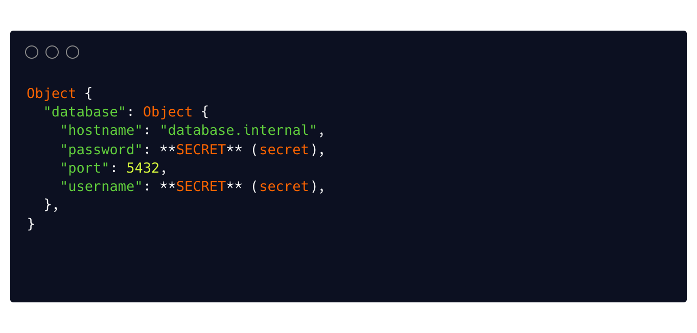

[](https://circleci.com/gh/pallad-ts/config/tree/master)
[](https://badge.fury.io/js/@pallad%2Fconfig)
[](https://opensource.org/licenses/MIT)

---
`@pallad/config` is a library that helps you create and maintain configuration objects in a type-safe manner with validation. 
Define smart configuration objects and initialize its properties from [different sources like](./providers) environment variables, configuration files.
Easily manage configurations for different environments like CI, production, or development.

## Features

* 👷 Built with Typescript
* 🔥 Supports loading configuration from env, envfiles, ssm
* 👌 Supports asynchronous configuration sources
* 🎒 Helpful presets for easy config definition
* 👀 Great CLI for browsing and validating final configuration
* 👶 Great for continuous integration (CI)
* 🧑‍🤝‍🧑 Type friendly
* ❤️ Easy integration with any kind of applications

## Screenshots
Define config
```ts title="/src/config.ts"

import {env} from '@pallad/config';

export function createConfig() {
    return {
        database: {
            hostname: env('DATABASE_HOSTNAME'),
            port: 5432,
            username: env('DATABASE_USERNAME').secret(),
            password: env('DATABASE_PASSWORD').secret()
        }
    };
}
```

